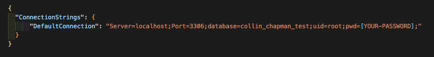
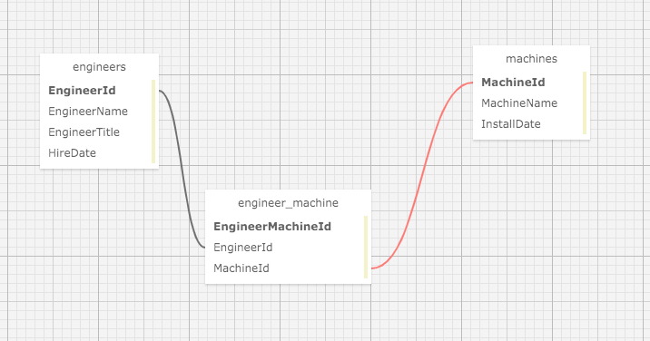

### _This project is not in a complete or portfolio ready state, and should not be considered representiational of professional work._

# Dr. Sillystringz's Factory

### Epicodus Independent Code Review - Many-To-Many Relationships

### By Collin Chapman

## Technologies Used

* Git
* C#
* .NET 5.0
* ASP.NET Core
* Entity Framework Core
* Razor View Engine
* MVC
* RESTful Routing, CRUD & HTTP
* REPL
* MySQL & MySQL Workbench
* Bootstrap
* CSS

## Description

This is a C# MVC web application built for the famous Dr. Sillystringz to keep track of the machine repairs for his factory. This application helps manages the engineers and the machines they are licensed to fix.

## Setup/Installation Requirements

* _Requires Visual Studio Code Installation_
* _Requires Terminal Installation_
* _Open the terminal on your local machine_
* _Navigate to the directory inside of which you wish to house this project_
* _Clone this project with the following command  `$ git clone <https://github.com/colchapm/Sillystringz.Solution.git>`_
* _Next you will need to download and install .NET Core through this link if you don't already have it: https://dotnet.microsoft.com/download_
* _After downloading and installing .NET Core, return to your terminal and navigate to the root directory by entering `$ cd Sillystringz.Solution`_
* _Open this project in Visual Studio Code with the command `$ code .`_
* _Still in the terminal, navigate to the desired subdirectory of the repository with the command `$ cd Factory`_
* _Retrieve and install packages listed in the .csproj files with the command `$ dotnet restore`_
* _Create internal content for build with the command `$ dotnet build`_
* _In Visual Studio Code, navigate to the `Factory` directory and create an **appsettings.json** file and input the following script (**note the name of the database can be whatever you would like (e.g. collin_chapman_test)**)_

* _If you do not have MySQL Workbench, it can be downloaded here: https://dev.mysql.com/downloads/file/?id=484391_
* _Create Initial SQL migration with the following command `$ dotnet ef migrations add Initial`_
* _Update the database in MySQL Workbench with the following command `$ dotnet ef database update` (**note this will title the database whatever you listed in your appsettings.json file (e.g. collin_chapman_test)**) _
* _Back in the terminal, navigate to `$ cd Factory` and run the application with the command `$ dotnet run`

## Diagram of the Many-To-Many relationship used in this project

## User Stories 

| Functionalities | 
|:---: |
| As the factory manager, Dr. SS needs to be able to see a list of all engineers, and they need to be able to see a list of all machines | 
| As the factory manager, Dr. SS needs to be able to select an engineer, see their details, and see a list of all machines that engineer is licensed to repair. They also need to be able to select a machine, see its details, and see a list of all engineers licensed to repair it | 
| As the factory manager, Dr. SS needs to add new engineers to our system when they are hired. They also need to add new machines to our system when they are installed | 
| As the factory manager, Dr. SS should be able to add new machines even if no engineers are employed. They should also be able to add new engineers even if no machines are installed | 
| As the factory manager, Dr. SS needs to be able to add or remove machines that a specific engineer is licensed to repair. They also need to be able to modify this relationship from the other side, and add or remove engineers from a specific machine |
| Dr.SS should be able to navigate to a splash page that lists all engineers and machines. Users should be able to click on an individual engineer or machine to see all the engineers/machines that belong to it |

## Known Bugs

Currently engineers can have the same machine assinged to them more than once

## Link

This project is not hosted on GitHub Pages

## License

Copyright (c) 2021 Collin Chapman

This software is licensed under the MIT license

## Contact Information

cchap14@gmail.com
